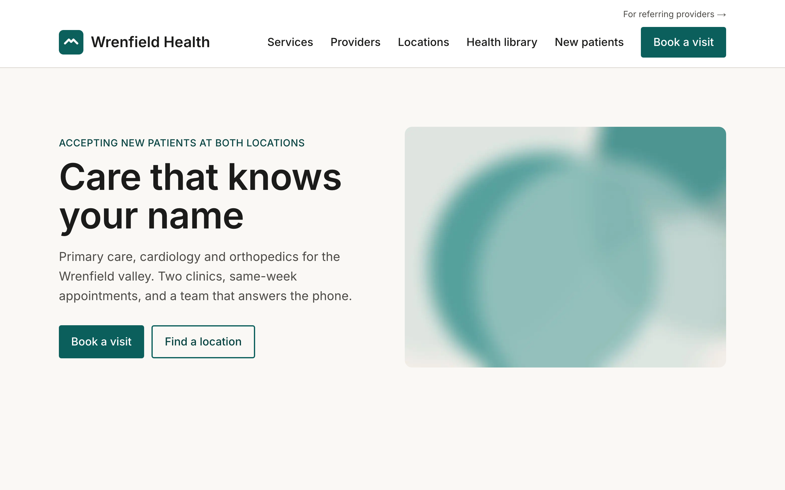

# Healthcare Sanity Starter

A small, opinionated Next.js + Sanity starter for healthcare and life-sciences marketing sites, for clinics, practices, and the agencies that build for them.

[](https://github.com/dock90/healthcare-sanity-starter/actions/workflows/ci.yml)
  

[](https://starter.dock90.io)

**Live demo:** [starter.dock90.io](https://starter.dock90.io), a fictional multi-specialty clinic, Wrenfield Health. The Studio is at [/studio](https://starter.dock90.io/studio).

## Why a healthcare starter

Generic starters make you decide the same four things on every healthcare build. This one has decided them.

- **Audience split.** Every page belongs to `patients` or `providers`. One dataset, one app, a `/for-providers` prefix, separate navigation. Referring physicians and patients stop getting each other's content.
- **PHI-safe forms.** Forms post to a webhook you control and are never stored or logged here. Field keys that look like health data (`dob`, `diagnosis`, `mrn`…) get a warning in the Studio that explains why. Turnstile, honeypot, accessible error states.
- **Consent-gated analytics.** An in-house consent dialog (necessary / analytics / marketing), no third-party CMP. GA4 loads only after consent. `track()` takes a closed union of events, there is no way to send a free-form string, so PII can't leak into analytics by accident.
- **Medical review + medical JSON-LD.** `reviewedBy` / `reviewedAt` are first-class fields on services and posts, rendered as bylines and emitted as structured data alongside `Physician`, `MedicalClinic`, `FAQPage` and `BreadcrumbList`.

Plus the things every site should have and most don't: WCAG 2.2 AA checked by axe in CI, Lighthouse budgets on every PR, a seeded accessibility statement, 44px targets, visible focus, reduced-motion respected.

## Quickstart

```bash
git clone https://github.com/dock90/healthcare-sanity-starter && cd healthcare-sanity-starter
cp .env.example .env.local && npm install
npm run dev
```

That's it. `.env.example` points at the public demo dataset, so the site renders Wrenfield Health immediately. To use your own content, create a Sanity project, change the three `NEXT_PUBLIC_SANITY_*` values, and run `npm run seed` (needs an editor token), or start from an empty dataset and open `/studio`.

`npx create-next-app -e https://github.com/dock90/healthcare-sanity-starter my-clinic` also works.

## What's in the box

**10 document types.** That's the whole content model.

| Type | What it is |
|---|---|
| `page` | Title, slug, audience, an ordered list of sections, SEO |
| `service` | Service line or condition; body, FAQs, related providers, medical review |
| `provider` | Clinician: credentials, headshot, specialties, accepting patients, locations |
| `location` | Address, map point, phone, structured hours, providers |
| `post` | Article with author, medical reviewer and review date |
| `person` | Author / reviewer |
| `faq` | Question, answer, category |
| `legalPage` | Privacy, terms, accessibility statement, notice of privacy practices |
| `redirect` | Old path → new path, compiled into the build |
| `settings` | Singleton: org, contact, nav per audience, default SEO, GA4 ID, consent copy |

**8 sections.** `hero` · `richText` · `cta` · `cards` · `faqs` · `providers` · `locations` · `form`. One renderer, keyed by `_type`, exhaustive.

**Routes.** `/` and `/for-providers` (pages by audience) · `/providers/[slug]` · `/locations/[slug]` · `/services/[slug]` · `/blog/[slug]` · `/legal/[slug]` · index pages for each · `/studio` · `/sitemap.xml` · `/robots.txt`.

**Scripts.**

| Command | Does |
|---|---|
| `npm run seed` | Loads the Wrenfield Health demo (idempotent) |
| `npm run typegen` | Extracts the schema and regenerates `sanity/types.ts` |
| `npm run import-redirects -- file.csv` | CSV → `redirect` documents |
| `npm run check-url-parity -- --old https://old --new https://new` | Old sitemap vs. new host; exit 1 on any broken path |
| `npm test` · `npm run e2e` · `npm run lhci` | Vitest · Playwright smoke + axe · Lighthouse budgets |

**Editorial.** Draft/publish, live preview from the Studio's Presentation tool (Vercel Draft Mode), on-publish revalidation, Studio grouped as *Pages by audience · Clinical · Content · Site*.

**Docs.** [`docs/DESIGN.md`](docs/DESIGN.md) (tokens + contrast table) · [`docs/COMPLIANCE.md`](docs/COMPLIANCE.md) (what this does and doesn't do about PHI, in plain language) · [`docs/MIGRATION.md`](docs/MIGRATION.md) (launch checklist) · [`docs/ADDING-A-TYPE.md`](docs/ADDING-A-TYPE.md) (a new document type in 20 minutes) · [`docs/DEPLOY.md`](docs/DEPLOY.md) · [`docs/DECISIONS.md`](docs/DECISIONS.md).

## What's deliberately not in it

No page builder with forty modules. No insurers, jobs, press or events types (each is a 20-minute add; the doc shows how). No theme switcher, dark mode, icon library or component library. No third-party consent tool, no GTM, no chat widget, no map embed. No search, no i18n, no authentication, no patient portal.

There is one way to do each thing. If you disagree, fork it; that's the point: the starter encodes a method, not options.

## Stack

Next.js 16 (App Router, TypeScript strict, React Compiler) · Sanity 6 with embedded Studio and TypeGen · `next-sanity` Live Content API · Tailwind 4 · Cloudflare Turnstile · Vitest · Playwright + axe · Lighthouse CI · Vercel.

## Further reading

The [healthcare website migration playbook](https://www.dock90.io/playbook) explains the method this starter encodes, one question per chapter. The chapters behind the starter's pieces:

- [Should you migrate at all?](https://www.dock90.io/playbook/should-you-migrate): the scorecard to run before starting.
- [What are you actually migrating?](https://www.dock90.io/playbook/what-you-are-actually-migrating): the inventory behind `docs/MIGRATION.md` "four weeks out".
- [How do you model content for a multi-audience healthcare site?](https://www.dock90.io/playbook/content-modeling-for-healthcare-sites): the schema in `sanity/schema/`, and `docs/ADDING-A-TYPE.md`.
- [How do you migrate a healthcare site without losing its search traffic?](https://www.dock90.io/playbook/redirects-and-seo-preservation): `import-redirects` and `check-url-parity`.
- [What is a healthcare marketing site allowed to collect?](https://www.dock90.io/playbook/forms-phi-consent-analytics): `docs/COMPLIANCE.md`, `lib/consent.ts`, `lib/track.ts`.

Or [every chapter on one page](https://www.dock90.io/playbook/all).

## Need it built for you?

Dock90 builds and migrates healthcare marketing sites on this stack. Fixed-price assessment, $12k → [dock90.io/assessment](https://dock90.io/assessment)

## License

MIT © [Dock90](https://dock90.io). The "Built with" footer link is optional; it's one line in `components/layout/Footer.tsx`.
